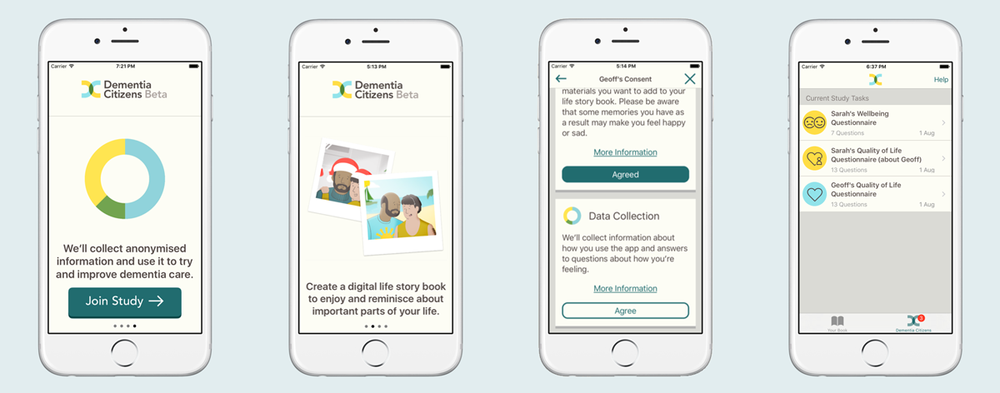

# Dementia Citizens iOS Research Code

[Dementia Citizens](http://dementiacitizens.org/) is a citizen science project aiming to connect people with dementia and their carers with researchers in dementia care. In August 2016, we launched two iOS Apps in Beta. This repository contains the shared code that implemented the research features of each application. This does **not** represent a finished framework or library and there is currently no plan to maintain it. Instead it is here as a public document of the project so that others could benefit from our work in this area.

This project contains the following features:

- An onboarding experience that enables people with dementia and their carers to give their informed consent
- Dementia research questionnaires optimised for mobile
- Task dashboard for organising research tasks and sending reminders
- Simple event logging to collect data and analytics
- Dementia friendly UI components and styles
- [Guidance on language used for the research projects](language.md)



## Installation

[Carthage](https://github.com/Carthage/Carthage) is recommended for installing this project. [This guide](https://github.com/Carthage/Carthage#if-youre-building-for-ios-tvos-or-watchos) for installing using Carthage might be useful. Add the following to your Cartfile:

```swift
github "nestauk/dementiacitizens"
```

The framework has a single dependency, [CommonCrypto](https://github.com/soffes/CommonCrypto). This can be set as optional in your 'Linked Frameworks and Libraries' for your target.

## Integrate the Project

In order to get the framework to run you will need to update your AppDelegate to look like the snippet below. This assumes you are starting with a new XCode project. `DCStudy(duration: DCStudyDuration, endMessage: String)` can be used to set up how long you want your study to run for and the final message. `baseURL` should be for the server address you want to send events to. `didLaunchWithName` is a string for the name of your study app.

``` swift
import DCPlatform
import CommonCrypto
import UserNotifications

class AppDelegate: UIResponder, UIApplicationDelegate, UNUserNotificationCenterDelegate {

  var window: UIWindow?

  var dcApplication: DCApplication!

  // Input your server address
  let baseURL = "http://localhost:3000"

  func application(_ application: UIApplication, didFinishLaunchingWithOptions launchOptions: [UIApplicationLaunchOptionsKey: Any]?) -> Bool {

    // Configure the duration of study, this example would run for 5 days
    // Currently the framework is set to trigger tasks at the beginning, middle and end of the study
    let study = DCStudy(duration: (unit: NSCalendar.Unit.day, value: 5), endMessage: "Thank you for taking part!")

    dcApplication = DCApplication.sharedApplication

    // Initialise the application with your configuration
    // The sharedSecret is a secret that should be used to authenticate the request on the server side
    dcApplication.application(application,
                              didLaunchWithName: "Your App Name",
                              launchOptions: launchOptions,
                              baseURL: baseURL,
                              sharedSecret: "g7Yu9nBh",
                              study: study)

    return true
  }

  func userNotificationCenter(_ center: UNUserNotificationCenter, didReceive response: UNNotificationResponse, withCompletionHandler completionHandler: @escaping () -> Void) {
    dcApplication.userNotificationCenter(center, didReceive: response, withCompletionHandler: completionHandler)
  }

  func applicationWillResignActive(_ application: UIApplication) {
    dcApplication.applicationWillResignActive(application)
  }

  func applicationDidBecomeActive(_ application: UIApplication) {
    dcApplication.applicationDidBecomeActive(application)
  }
```

The final step to get the project building is to create a new `UITabBarController` and set it as the initial view controller on your `main.storyboard`. Then set it's class as `DCRootController` and it's module to `DCPlatform`. Lastly you will need to take the files from [/FlowExamples](/FlowExamples) and copy them in to your XCode project. This will implement the Dementia Citizens dashboard where study tasks appear.

## Logging Events

If you need to share data with a back-end, you should make use of the `EventLogger`. This framework makes no assumptions about the data structures on the back-end, and instead sends arbitrary events made up of an event type and optional parameters:

```swift
DCApplication.sharedApplication.events.log("eventType", params: ["dataKey": data])
```

This line makes a `PUT` request to the server at your `baseURL` at `/events`. A simple back-end to receive and process event data like this could be set up on [Ruby on Rails](http://guides.rubyonrails.org/getting_started.html). The app could choose to store these events as-is in a schema-less database, or to set up a domain-specific schema and process each event as it is received in order to make the required updates to the relevant tables.

## Dementia Citizens Links

You can find out more about these projects through these links:

- [dementiacitizens.org](http://dementiacitizens.org/)
- [More about Dementia Citizens at Nesta](http://www.nesta.org.uk/project/dementia-citizens)
- [More about Dementia Citizens at Ctrl Group](https://www.ctrl-group.com/projects/dementia-citizens/)
